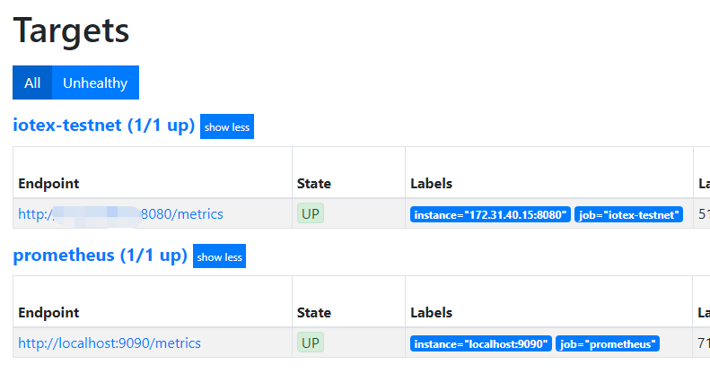
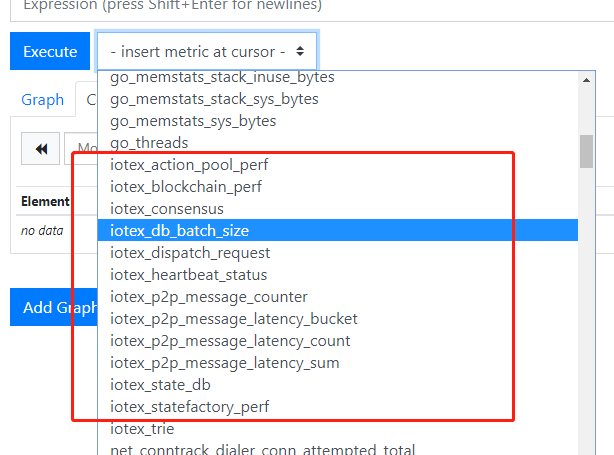
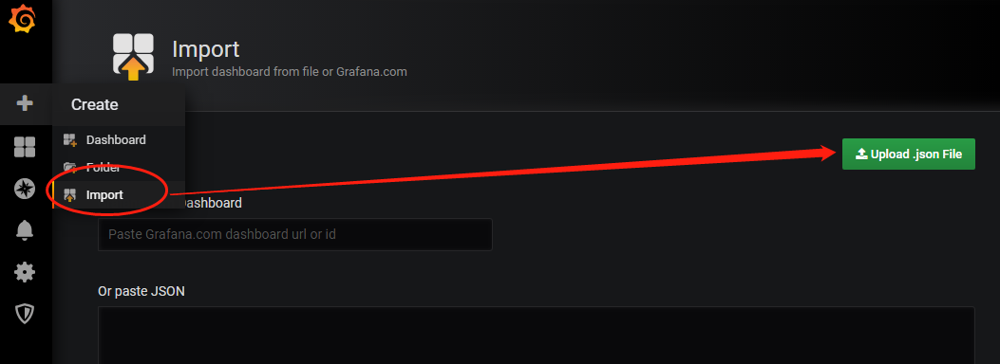
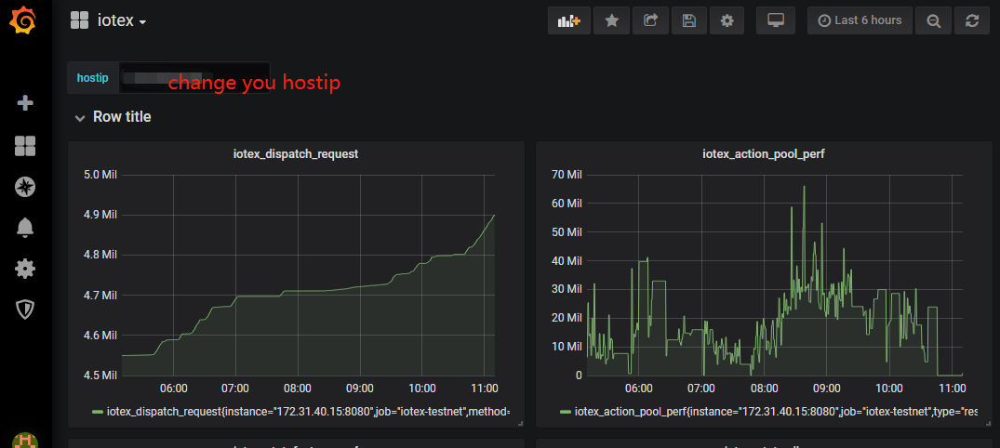

# Visualize Metrics of Your Fullnode

## Precondition

- docker installed
- full node connected to mainnet-rehearsal (https://github.com/iotexproject/iotex-testnet)

## Setup Prometheus
Prometheus is an open-source systems monitoring and alerting toolkit originally built at SoundCloud. Since its inception in 2012, many companies and organizations have adopted Prometheus, and the project has a very active developer and user community. It is now a standalone open source project and maintained independently of any company. We use prometheus as the backend for the monitoring of IoTeX fullnodes.

### Custom Config  
reference: https://prometheus.io/docs/prometheus/latest/configuration/configuration/

**get system eth0 ip**  

    hostip=$(hostname -i|awk '{print$1}')

    cat <<EOF> ~/prometheus.yml
    global:
    alerting:
      alertmanagers:
      - static_configs:
        - targets:
    rule_files:
    scrape_configs:
      - job_name: 'prometheus'
        static_configs:
        - targets: ['localhost:9090']
      - job_name: 'iotex-testnet'
        static_configs:
        - targets: ["${hostip}:8080"]
    EOF

### Download and run prometheus

    sudo docker pull prom/prometheus

    sudo docker run -d \
      -p 9090:9090 \
      -v ~/prometheus.yml:/etc/prometheus/prometheus.yml \
      prom/prometheus \
      --config.file=/etc/prometheus/prometheus.yml

### Check prometheus status
    sudo netstat -nltp|grep 9090
    open http://${hostip}:9090/targets

- check target

- check metric

## Setup Grafana
Grafana is an open source metric analytics & visualization suite. It is most commonly used for visualizing time series data for infrastructure and application analytics but many use it in other domains including industrial sensors, home automation, weather, and process control. We use prometheus as the frontend for the monitoring of IoTeX fullnodes.

### Download and run Grafana
    docker pull grafana/grafana
    docker run -d --name=grafana -p 3000:3000 grafana/grafana

### Check Grafana status
    sudo netstat -nltp|grep 3000
    open http://${hostip}:3000

- download iotex template: [iotex-grafana.json](https://raw.githubusercontent.com/iotexproject/iotex-testnet/master/monitoring/iotex-grafana.json)

- import you grafana

## Setup in Kubernetes
You can use [prometheus operator](https://github.com/coreos/prometheus-operator) in k8s.
To set it up, you can install this helm chart: https://github.com/helm/charts/tree/master/stable/prometheus-operator
